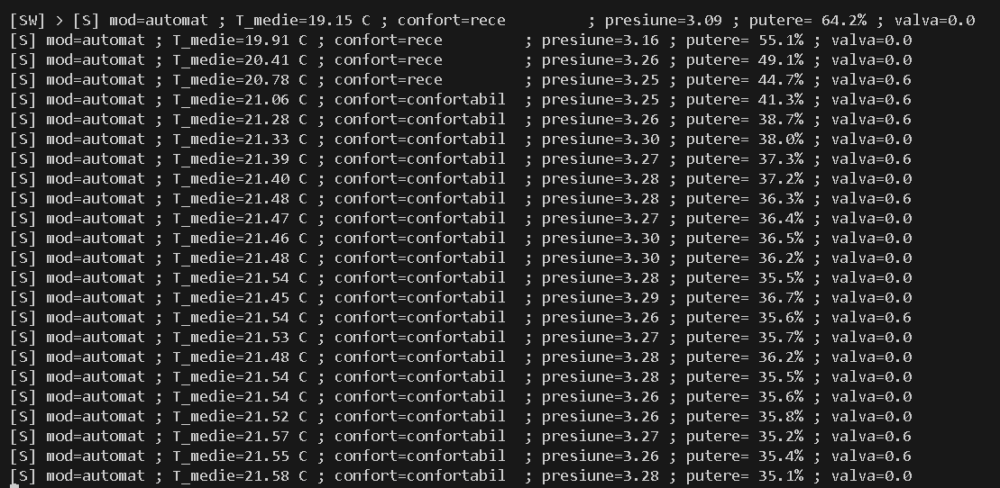
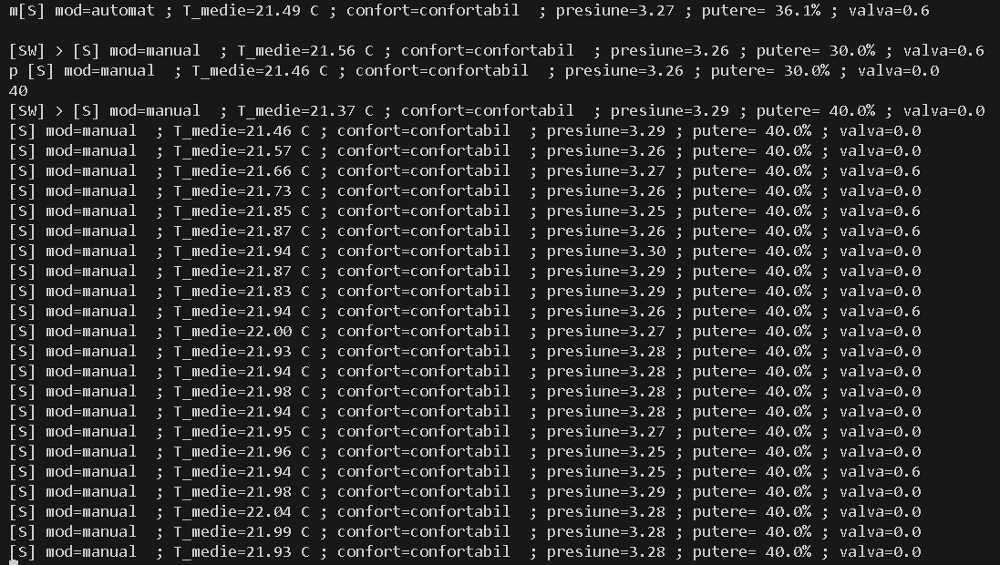
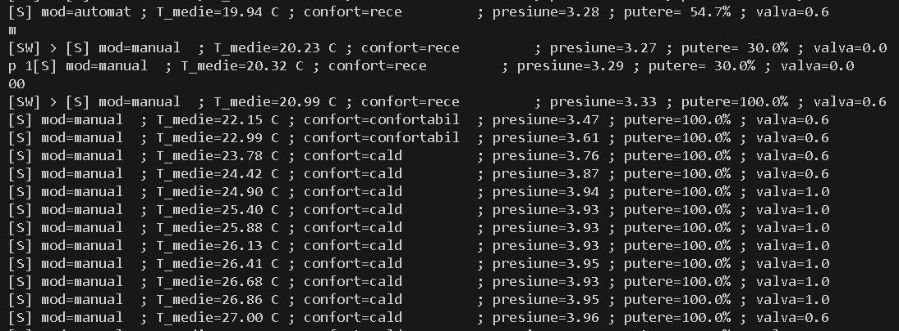
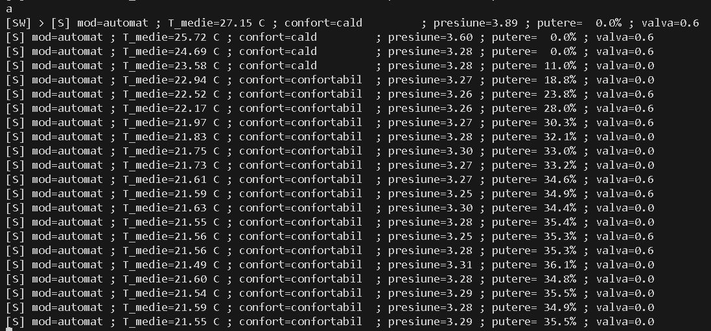

# Smart Room Heating Control

Python project for simulating and controlling a room heating installation (manual and automatic modes), with temperature regulation as the main objective and pressure valve control for the installation.

## Overview

This project simulates a room heating installation controlled through concurrent software tasks (threads).

The system supports:
- **manual mode**, where the user directly sets the heating power
- **automatic mode**, where the control logic adjusts heating power to maintain a target temperature

In addition to temperature regulation, the project also simulates **pressure behavior** in the installation and **pressure valve control** to keep the system within safe operating limits.

The implementation uses message queues and synchronized shared state between tasks/threads to model the behavior of a simple control system.

For additional details, implementation notes, and scenario explanations, see the included report:
- `Smart-Room-Heating-Control-Report.pdf` *(Romanian, university project report)*

## Main Features

- Room temperature simulation with multiple temperature sensors (thermocouple-like readings)
- Manual and automatic operating modes
- Automatic heating power computation based on temperature error
- Pressure simulation and monitoring
- Pressure valve control logic (safety/relief behavior)
- Concurrent task-based architecture using threads
- Inter-task communication using queues
- Shared-state synchronization using locks (`Lock`) and stop signaling (`Event`)
- Console command interface for runtime control

## Control / Task Architecture

The implementation models several logical tasks:

- **SW** – user interface / command input task
- **T** – periodic temperature acquisition task
- **S** – decision/control task (comfort evaluation + automatic power command)
- **P** – periodic pressure task (pressure update + valve action)

The tasks communicate through queues and coordinate using synchronized shared state.

## Supported Console Commands

- `a` – switch to automatic mode
- `m` – switch to manual mode
- `p <0..100>` – set manual heating power (percentage)
- `q` – stop the program

## Project Structure

- `heating_control.py` – main Python script (simulation + control logic + threads)
- `Smart-Room-Heating-Control-Report.pdf` – project report (Romanian)
- scenario screenshots/results:
  - `scenario-1.png`
  - `scenario-2.png`
  - `scenario-3.png`
  - `scenario-4.png`

## Requirements

- Python 3.x
- No external dependencies (uses only Python standard library modules)

## How to Run

1. Open a terminal in the project folder.
2. Run the script:

    python heating_control.py

3. Use the console commands to switch modes and control the system:
   - `a`
   - `m`
   - `p 80`
   - `q`

## Example Behavior

In automatic mode, the controller computes heating power based on the difference between:
- measured average temperature
- target/reference temperature

The pressure task updates the installation pressure periodically and opens the valve when pressure exceeds normal/safety thresholds.

## Scenario Screenshots

### Scenario 1

### Scenario 2

### Scenario 3

### Scenario 4

## Notes

- Some comments/identifiers in the source code may be in Romanian because the project was developed as part of university coursework.
- The included PDF report is also in Romanian, but it contains additional implementation details and scenario explanations.
- The code is kept in a single script for clarity and to preserve the original project structure.

## Author

**Alex Traistaru**  
Student, Automatic Control and Computers (UPB)
